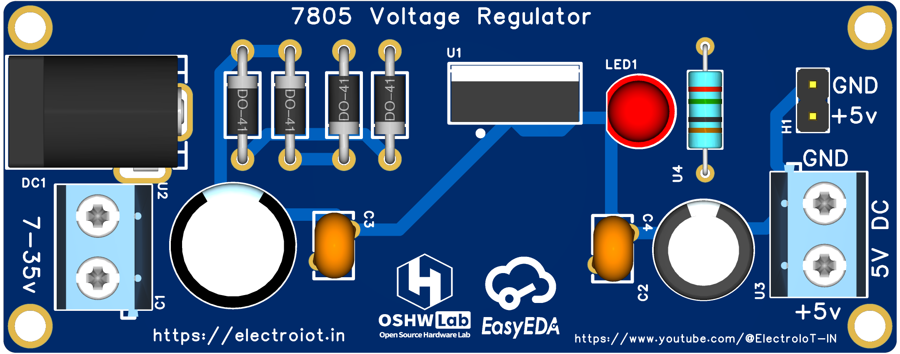

<!-- Banner/logo section -->

  

<h1 align="center">EasyEDA Tutorial Projects by ElectroIoT</h1>

  <b>Welcome to the official repository for EasyEDA tutorial projects!</b> 
  <i>Learn, create, and share electronics the right way – one project at a time.</i>

---

## 🚀 About This Repository

This repository is **your one-stop hub for EasyEDA projects** demonstrated on my [YouTube Channel](https://www.youtube.com/@ElectroIoT-IN).  
Every project comes with files, schematics, and Gerber, and is open for you to learn, use, or even improve (pull requests are always welcome – like a good cup of tea!).

My goal?  
**25 complete, step-by-step projects** with practical value for hobbyists, students, and pros.  
Currently, there are **2 projects** – and we’re just getting started!

---

## 📺 Watch and Learn

- **[YouTube Channel](https://www.youtube.com/@ElectroIoT-IN)**
- **[EasyEDA Projects Playlist](https://www.youtube.com/watch?v=ExzUpKTVh7Y&list=PLY1MLyrEvdxWnuOv2MRS0lb-Y7f6nGiOh)**

---

## 🌐 More About Me

- **Website:** [https://electroiot.in](https://electroiot.in)
- **Email:** [electroiot.in@gmail.com](mailto:electroiot.in@gmail.com)
- **GitHub:** [github.com/ElectroIoT](https://github.com/ElectroIoT)
- **YouTube:** [@ElectroIoT-IN](https://www.youtube.com/@ElectroIoT-IN)

---

## 📂 Projects

| Project | Preview | Description |
|---------|:-------:|:-----------|
| [7805-Voltage-Regulator](./7805-Voltage-Regulator) |  | Simple 7805 linear voltage regulator PCB project |
| [Multi-Voltage-Regulator-PCB-(12V-9V-5V-3.3V)](./Multi-Voltage-Regulator-PCB-(12V-9V-5V-3.3V)) |  | PCB with selectable outputs: 12V, 9V, 5V, 3.3V |

*Click project names to access folders with design files and docs.  
*To add your own image: place a `preview.jpg` inside the project folder.

---

## 🏆 **Road to 25 Projects**

- [x] 7805 Voltage Regulator
- [x] Multi Voltage Regulator PCB (12V/9V/5V/3.3V)
- [ ] Project 3 - Coming soon!
- [ ] Project 4
- [ ] ...and more up to 25!

Do you have an idea for a project? [Open an issue!](https://github.com/ElectroIoT/EasyEDA-Tutorial-Project/issues)

---

## 🤝 How to Use/Contribute

1. **Browse** the projects above – each folder has schematic, PCB, and (if needed) BOM.
2. **Watch the video** for step-by-step instruction (linked in project folder’s README).
3. **Contribute:** Pull requests for bugfixes, improvements, or new projects are very welcome.
4. **Star** this repo to support open learning!

---

## 📜 License

All designs are under [MIT License](LICENSE) – free to use, but don’t forget about good manners (give credit!).

---

> **Electronics is best learned with a soldering iron in one hand, and a cup of tea in the other. Happy tinkering!**

  

